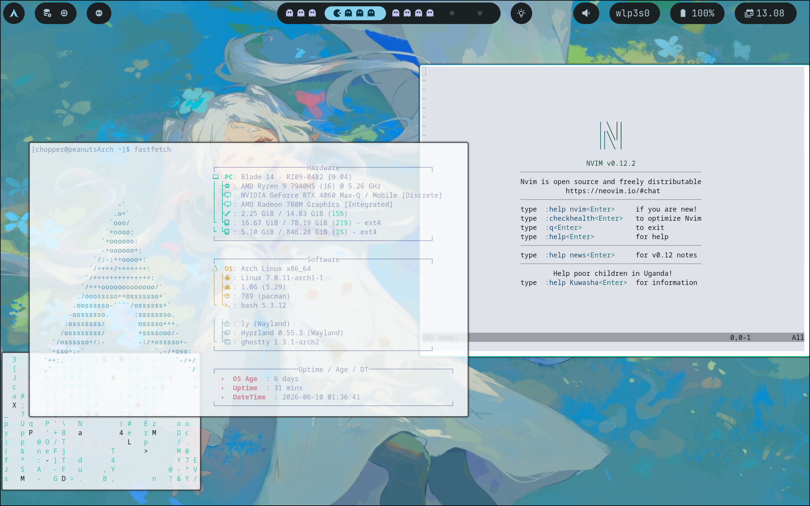
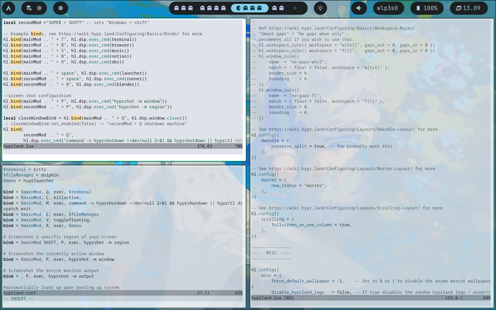

# PeanutArch/Linux Ricing

## ✍️ Overview

PeantArch/ArchLinux
PeantArch/ArchLinux
Jun 2026 - PresentJun 2026 - Present
This summer, I decided to challenge myself by manueling installing and maintaining Archlinux.
Archlinux is one of the many linux distros like Ubuntu and Fedora, but it forces users to build their OS from the ground up. Package management tools like pacman and yay were used to configure this system, and regular/shell scripting were use to execute and test programs/applications. Hyprland, a customizable desktop environment was used which allowed me to build a beautiful UI for my system.

    

## 🌟 Highlights
+ Clean User Interface
+ neovim might be better than VScode?
+ FREEDOM to customize
+ no nvidia open souyrce Drivers ;(
+ fix it yourself mindset

## 🚀 Software Resources
+ OS: [Arch Linux] (https://archlinux.org/)
+ DE: [Hyrpland] (https://hypr.land/)
+ Packages: [Drive] (https://drive.google.com/drive/folders/1XY19H8bru6Uwyn17qjzUYw9bJ60hamP8?q=sharedwith:public%20parent:1XY19H8bru6Uwyn17qjzUYw9bJ60hamP8)

## 💻 Laptop Specs
+ PC: [Blade 14 2023](https://mysupport.razer.com/app/answers/detail/a_id/13030/~/razer-blade-14-%282023%29-%7C-rz09-0482x-support-%26-faqs)
+ Cpu: [AMD Ryzen 9 7940HS](https://www.amd.com/en/products/processors/laptop/ryzen/7000-series/amd-ryzen-9-7940hs.html)
+ GPU 1: [GeForce RTX 4060](https://www.nvidia.com/en-us/geforce/laptops/40-series/)
+ GPU 2: AMD Radeon 780M Graphics
+ Storage: 1TB
+ Memory: 16 GB

## 💭 Feedback/credits/Conclusion 

 If you would like to give any  feedback or for any reason, reach out to me in my personal[ discord server](https://discord.gg/9ajN3BXcu). I would love to chat :) 

I have to my thanks to the **Archlinux and Hyprland community** for helping me set up this project. This was many times where I wanted smash Gemini, ChatGpt and claude against the wall for giving me garabage code/suggestion that didn't even work. But man, going through peoples orignal code and past mistakes how they fixed them really helped me out 

As for my Last final thoughts, This project is still under development because there is a lot of things i need to fix like; Audio, random shutdowns when laptop is not charging(might be a hyprland problem) and I would like to add more customization like a; clean display manager, wallpaper/waybar theme switcher, and more! But as of right now I am currently working on other projects so I will be working on this time to time. Thank you again for going through this repo and hope you all have a great day.

 ## Hyprland Gallery

All Rights Reserved | Isaiah Santamaria